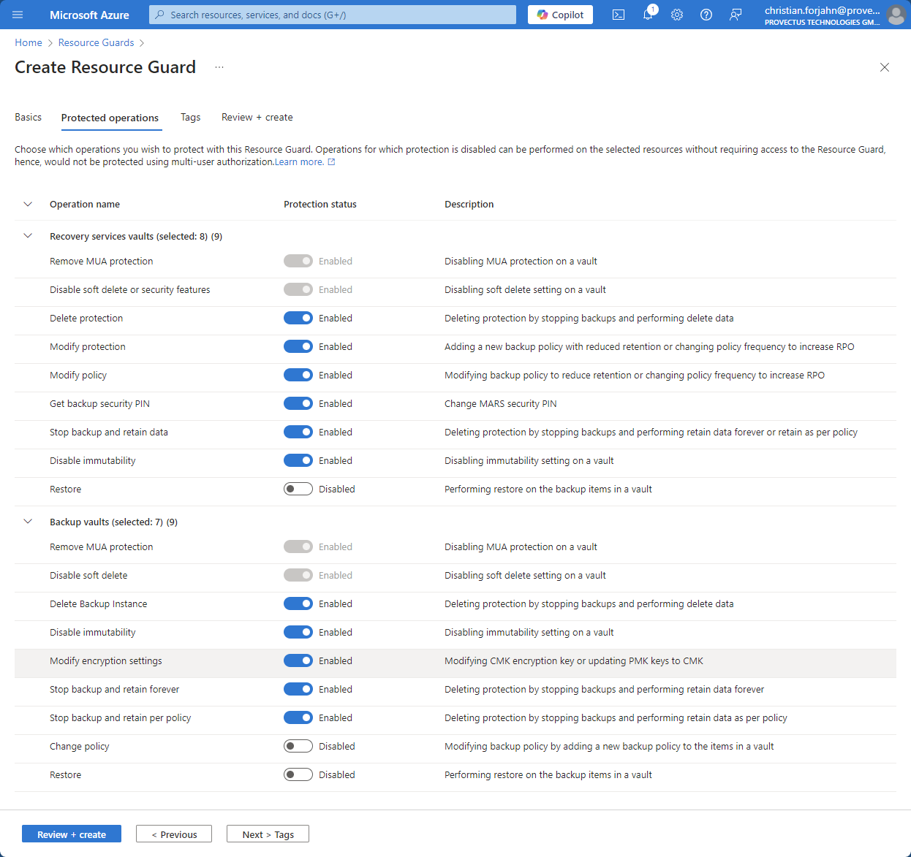
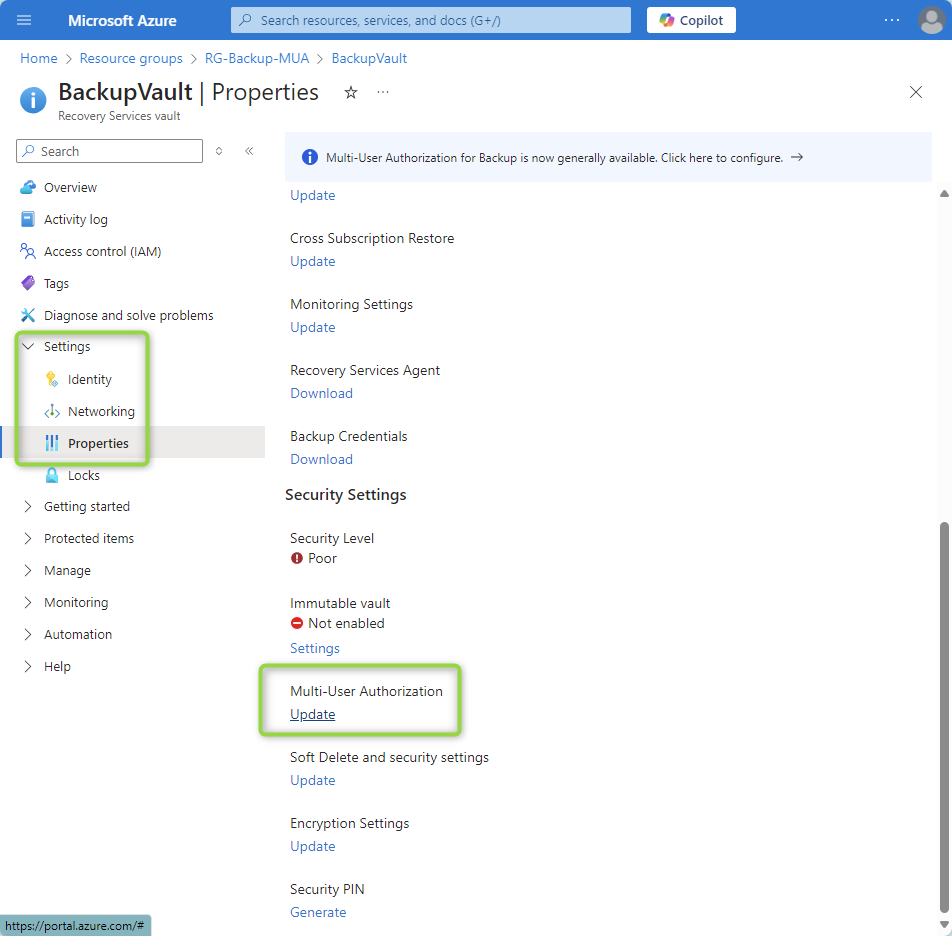

When we talk about Azure Backup, it’s not just about creating backups; it’s about ensuring **reliable recovery** when it matters most. Nobody needs backups, everyone needs recovery! Whether it's accidental data deletion, unexpected outages, or ransomware attacks, **Azure Backup** is an essential tool for protecting your IaaS and PaaS workloads.

## Why You Need Azure Backup with Multi-User Authorization (MUA)

Imagine a scenario where a backup operator's credentials are compromised during a cybersecurtiy attack. Even though Azure Backup is secure by design and prevents the encryption of backup data, attackers might still attempt to harm the organization by deleting the backups. This is where **Multi-User Authorization (MUA)** comes in as a game-changer.

By requiring administrative access to perform sensitive actions like deleting backups, MUA adds a critical layer of protection. It ensures that even if one account is compromised, malicious actors cannot single-handedly tamper with or delete your backup data.

### What is Multi-User Authorization (MUA)?

MUA adds another layer of security by requiring explicit authorization from the **Resource Guard** service for critical actions such as deletion or modification of backups. This drastically reduces the risk of insider threats or accidental misconfigurations.

MUA is one of the most **overlooked yet vital solutions** that every organization should adopt. Not only is it free, but it also provides an essential safeguard for backup operations.

## Configuring Multi-User Authorization for Azure Backup

Here’s a step-by-step guide on how to configure MUA to protect your Azure Backup or Recovery Services Vault effectively.

### Step 1: Create a Resource Guard in Another Tenant

Start by logging into the Azure Portal and creating a new Resource Guard resource. For optimal security, it’s recommended to create the Resource Guard in a **different tenant** to separate security accounts and operations completely.

{: .img-fluid}

1. Assign a name to the Resource Guard and ensure it is in the **same region** as your backup vault.  
2. Configure the operations the Resource Guard will protect, such as "Delete protection" and "Modify protection."  
3. Use the **"Access Control (IAM)"** blade to grant access.  
4. Assign the **Reader role** to the external backup administrator by entering their email. The user will receive an email invitation, which must be accepted before proceeding.  

{: .img-fluid}

### Step 2: Configure the Backup Vault in the Other Tenant

Once the Resource Guard is set up, switch to the other tenant where the Azure Backup Vault resides and configure it to use the Resource Guard.  

1. Navigate to the **Backup Vault's settings page** and select "Settings -> Properties."  
2. Update the MUA settings to enable protection with the Resource Guard.  

{: .img-fluid}

3. Authenticate and select the Resource Guard from the other tenant. The backup administrator, with Reader permission, will now be able to access and link the Resource Guard to the Backup Vault.  

{: .img-fluid}

### Step 3: What Happens When a Delete Operation is Triggered?

If a backup administrator attempts to delete a backup without the appropriate permissions on the Resource Guard, the operation will be blocked. Only users with the **"Backup MUA Operator"** role on the Resource Guard can authorize such critical actions.  

{: .img-fluid}

This ensures that unauthorized deletion attempts—whether accidental or malicious—are effectively prevented.

## Conclusion: Secure Your Backup Strategy with MUA

Azure Backup provides a robust foundation for data recovery, but adding **Multi-User Authorization (MUA)** elevates your backup security to the next level. MUA ensures that no single account can compromise your backups, protecting your organization from accidental deletions, insider threats, and ransomware attacks.

Configuring MUA is straightforward, free, and incredibly effective. By integrating a Resource Guard from another tenant, you can establish a strong separation of duties and enhance your overall security posture.

Don’t wait for a data loss incident to realize the importance of recovery readiness. **Secure your Azure Backup strategy today with Multi-User Authorization and stay prepared for any scenario!**
