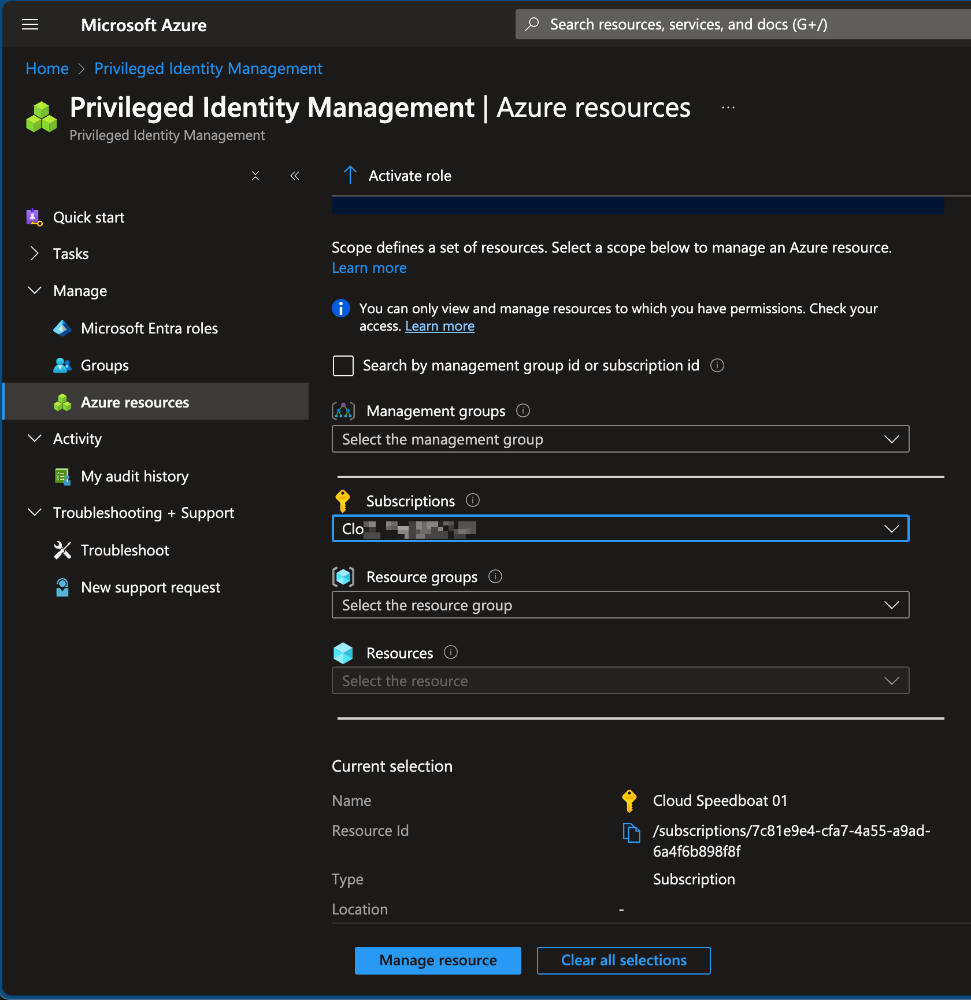
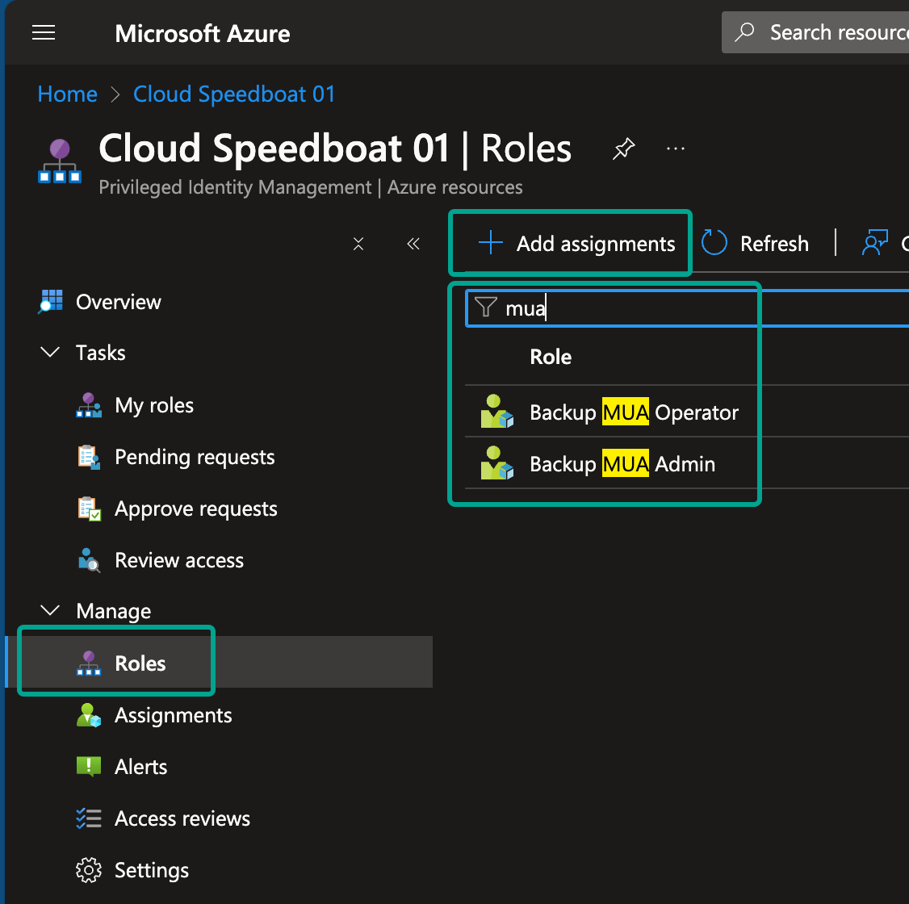
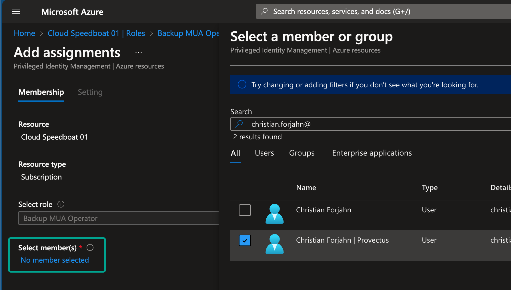
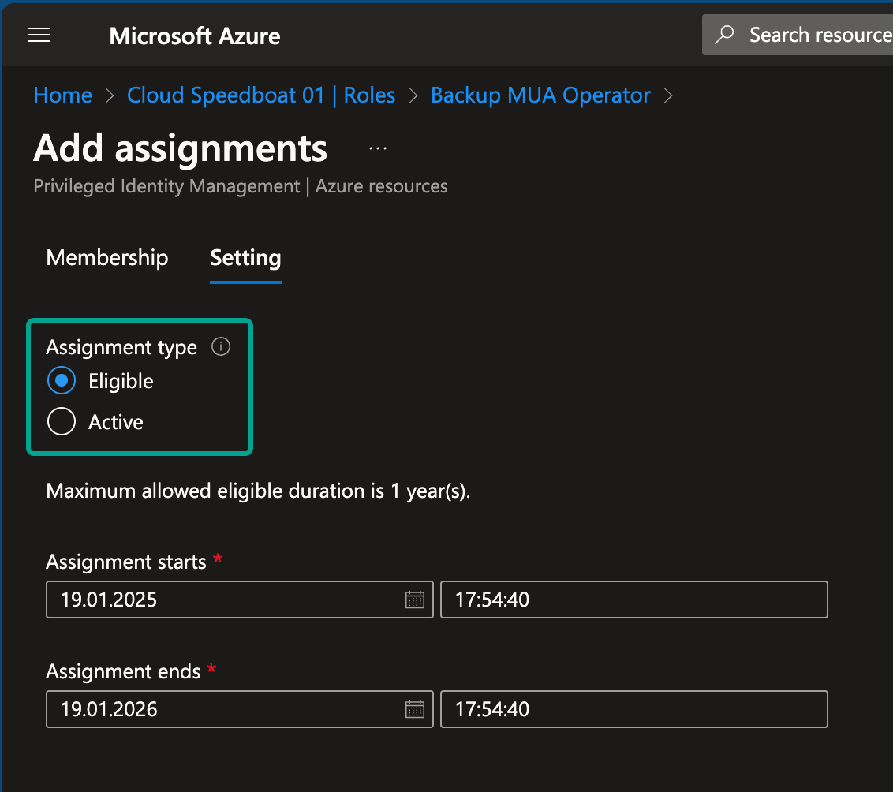
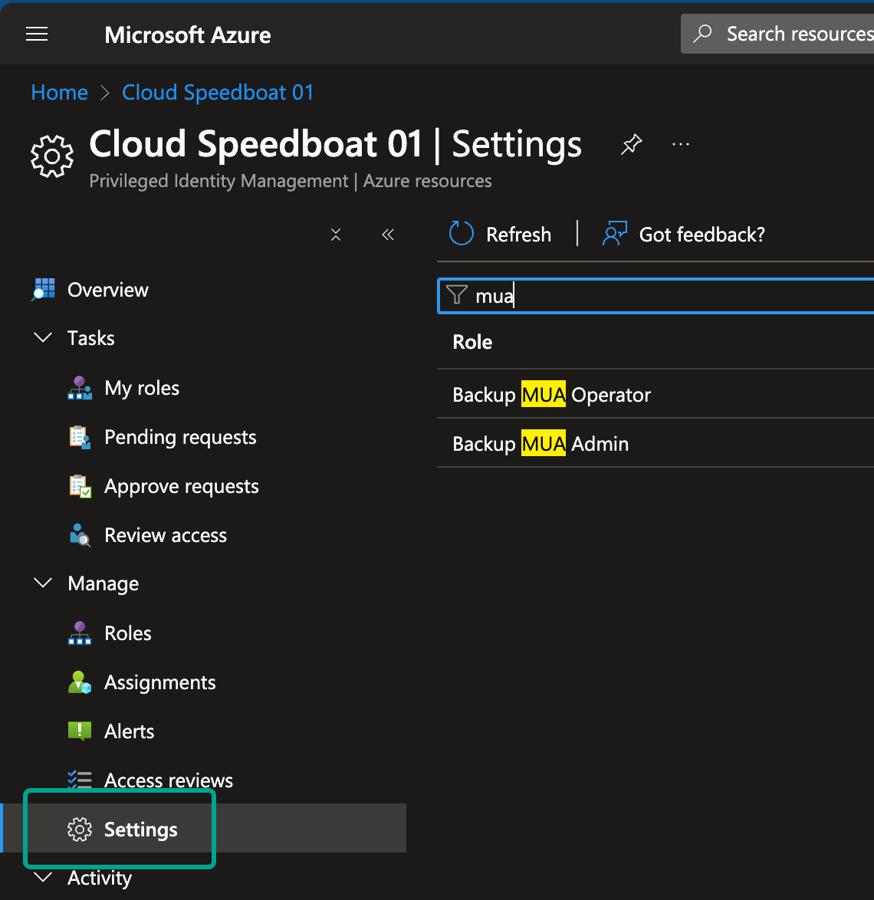
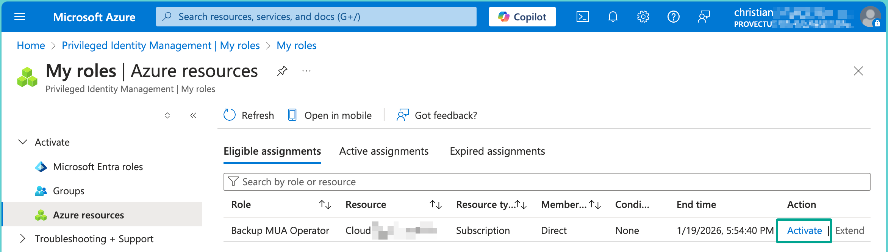

In my recent blog post, I discussed [how to secure backups using Azure Resource Guard](./2025-01-01-overlooked-azure-backup-feature-additional-security-with-multi-user-authorization-mua.md) and the **Backup MUA Operator** role, ensuring that only authorized users can perform sensitive operations. Now, let’s take it a step further: by integrating **Azure Privileged Identity Management (PIM)**, you can elevate security and enforce **just-in-time (JIT)** access, ensuring admin roles are only active when needed.  

Think of PIM as a carpool manager. Imagine an employee needs a pool car to complete a task. They ask the pool manager for the keys, which are provided for a limited time to accomplish the job. Once done, the keys are returned. PIM works similarly by granting temporary admin privileges, reducing the risks of permanent elevated access while ensuring users can perform their tasks effectively.  

## Why I’m a Fan of PIM  

I’m a huge advocate for **Privileged Identity Management** because it supports the principles of **least privilege** and **just-in-time access**. Admins can activate the privileges they’re eligible for, perform their tasks, and then lose those elevated permissions when they’re no longer needed. This minimizes the attack surface, prevents misuse, and aligns perfectly with modern security best practices.  

## What is Privileged Identity Management?  

At its core, PIM allows you to assign admin roles **only when needed**. Users don’t retain permanent access to high-privilege roles; instead, they activate these roles temporarily for specific tasks. This approach ensures that permissions are granted only when necessary, enabling models like **Just Enough Access (JEA)** and adhering to the **principle of least privilege**.  

### Key Features of PIM  

PIM provides robust tools to manage administrative access securely:  

- **Just-in-time privileged access** to Microsoft Entra ID and Azure resources.  
- **Time-bound access** with start and end dates.  
- **Approval workflows** for role activation.  
- **Multifactor authentication (MFA)** enforcement during role activation.  
- **Activity justification** to document why a role is activated.  
- **Notifications** for role activations.  
- **Access reviews** to ensure roles are still needed.  
- **Audit history** for compliance and review purposes.  
- Prevents removal of critical roles like **Global Administrator** or **Privileged Role Administrator**.  

## Prerequisites for Using PIM  

Before you start, make sure your environment meets these requirements:  

1. **Licensing**:  
   - Each user using PIM needs a **Microsoft Entra ID P2 license** or equivalent.  
   - Guest users are free.  
   - If you haven’t used it yet, there’s a free trial available ([see Microsoft’s documentation](https://learn.microsoft.com/en-us/entra/id-governance/licensing-fundamentals#starting-a-trial){:target="_blank"}).  

2. **Admin Roles**:  
   - To configure PIM, you’ll need the **Privileged Role Administrator** or **Global Administrator** role.  

## Setting Up PIM: A Step-by-Step Guide  

Let’s revisit the example from my last blog post, where backups are protected by **Resource Guard**. Only users with the **Backup MUA Operator** role can perform secured backup tasks, such as deleting backups. Using PIM, we can make this role eligible for activation only when needed.  

### Step 1: Open PIM in Azure Portal  

1. Go to the [Azure Portal](https://portal.azure.com/){:target="_blank"}.  
2. Search for **Privileged Identity Management** and select **Management > Azure Resources**.  
3. Define the scope for which you want to grant access (e.g. a management group, a subscription or resource group).

{: .img-fluid}

### Step 2: Configure the Role  

1. Filter for “mua” and select the **Backup MUA Operator** role.  

{: .img-fluid}

2. Click **Add assignment**, then select the user or group. In this example, I chose the external account responsible for backups in another tenant.  

   - **Eligible**: The user can activate the role when needed.
   - **Active**: The user has permanent access (not recommended for sensitive roles).

{: .img-fluid}

{: .img-fluid}

### Step 3: Customize Settings  

Under the role settings, you can define:  

- **Activation duration**: How long the role remains active after activation.  
- **MFA requirements**: Ensure MFA is required for activation.  
- **Approval workflows**: Add an extra layer of security by requiring approvals.  
- **Notifications**: Specify who will be informed when the role is activated.  

{: .img-fluid}

### Step 4: Activate the Role  

Once the role is assigned, the user can activate it when needed. After activation, they can perform the secured operations, such as modifying or deleting backups.

I chose to select the light Portal theme for the foreign user.

{: .img-fluid}

## Pro Tip  

Approval workflows can take time, but are effective especially for highly sensitive roles. To avoid delays, users can request access in advance for a specific timeframe, ensuring they have the necessary permissions when they need them.  

## Conclusion  

Azure Privileged Identity Management (PIM) is a powerful tool to manage administrative access securely. By enforcing just-in-time access, time-bound roles, and approval workflows, PIM drastically reduces the risks of excessive permissions while empowering admins to perform their tasks efficiently.  

When combined with **Multi-User Authorization (MUA)** and **Resource Guard**, PIM enhances your backup security, ensuring that even critical roles like **Backup MUA Operator** are tightly controlled.  

Take the time to configure PIM in your environment. The benefits far outweigh the effort, and it’s a crucial step toward a more secure cloud infrastructure.
