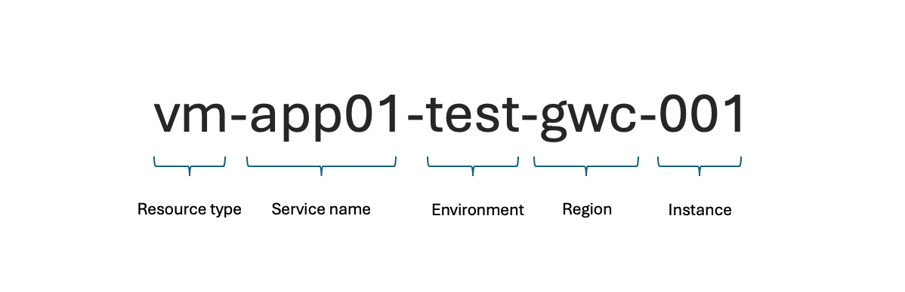

A **naming policy** is essential when moving to the cloud. A well-defined naming convention helps maintain order within your subscriptions and enables quick identification of connected resources.

In this blog post I want to start with the essentials of naming conventions. What are the rules? What are good ideas and what aren't? After that I will show you my preferred variant of ensuring naming policies by using Infrastructure as Code and the azurecaf module together with ...

## My Brief History of Naming Conventions

Over the past 12 years, I've seen many Azure environments evolve. Most customers started with an ungoverned approach before implementing company-wide rules and guardrails. This shift significantly improved their scalability and prevented operational chaos.

You might be familiar with naming conventions like planets, Star Wars characters, or Lord of the Rings references. While fun, these approaches become impractical as environments grow, especially with multi-region deployments. A structured naming convention is crucial to meet expanding demands.

## Why Naming Conventions Matter

Microsoft provides best practices for structuring resource names in Azure. A good naming convention enhances manageability, security, and automation as it makes you identifying resources directly, shows connections between resources etc. 

### Key Naming Components



Source: $link

When defining names, consider:

- **Resource Type** (VM, Storage, VNet, etc.)
- **Environment** (Prod, Dev, Test, Staging)
- **Service Name** (e.g., Marketing-DB, ERP-Addon)
- **Region** (e.g., EU, US, APAC)

### Unique Naming Constraints

Not all Azure resources follow the same naming rules. There are resources that allow upper- and lowercase, hyphens, etc. while others don't. Some need unique names, ... It can quickly become a challenge.

Depending on the scope there are also requirements for uniqueness:

- **Global**: DNS-dependent resources must be globally unique.
- **Resource Groups**: Resources of the same type within a group must have unique names.
- **Child Resources**: Subnets within a VNet must have unique names.

A **lowest common denominator** approach helps ensure naming consistency across different resource types.

## Best Practices for Azure Naming Conventions

Using **hyphens (-) for separation** improves readability. 
Define and standardize key components for resource names to enhance governance and automation.

## Automating Naming Conventions

Let's dive into the fun part now! How do we use IaC to automatically implement and enforce our naming convention? 

### Why Automation Matters

Consistency is key. Establishing a naming convention manually is error-prone, but automation ensures compliance.

**Terraform** simplifies enforcing naming standards using variables and Microsoft's **Cloud Adoption Framework (CAF) Naming Module**.

### Example: Terraform Naming Approaches

#### Option 1: Fixed Value Names

The starter when using Infrastruvcture as code is to simply add the plain text into the "name" field.

```terraform
resource "azurerm_resource_group" "rg" {
  name     = "rg-naming-test-gwc-001"
  location = "germanywestcentral"
}
```

#### Option 2: Using Variables

If you want to reuse variables, for example for multiple resources in the same region, you can define variables for that.

```terraform
variable "rg-name" {
  default = "rg-naming-test-gwc-001"
}

resource "azurerm_resource_group" "rg" {
  name     = var.rg-name
  location = "germanywestcentral"
}
```

#### Option 3: Combining Multiple Variables

If you are going to create mutliple resources you may want to reuse parts like prefixes, suffixes, etc. Then you can split your variables into smaller parts and concatinate them in the resource block.

```terraform
variable "type" {
  default = "rg"
}
variable "name" {
  default = "naming"
}
variable "env" {
  default = "test"
}
variable "region_short" {
  default = "gwc"
}

resource "azurerm_resource_group" "rg" {
  name     = "${var.type}-${var.name}-${var.env}-${var.region_short}-001"
  location = "germanywestcentral"
}
```

#### Option 4: Using Azure CAF Naming Module (Preferred)

By leveraging the **CAF Naming Module**, you can define your naming scheme once and reuse it for all future resources. Some parts are baked in, like the abbreviations for the type, others can be defined in the "data" block.

```terraform
# provider.tf
terraform {
  required_providers {
    azurerm = {
      source  = "hashicorp/azurerm"
      version = ">=4.1.0"
    }
    azurecaf = {
      source = "aztfmod/azurecaf"
    }
  }
}
```

```terraform
# main.tf
locals {
    location = "germanywestcentral"
    region_short = ["gwc"]
    name = "naming"
    caf_prefixes = ["myapp"]
    caf_suffixes = ["test", "001"]
    common_tags  = {
        environment = "Test"
        team        = "Cloud Infrastructure"
    }
}

data "azurecaf_name" "rg" {
    name          = local.name
    resource_type = "azurerm_resource_group"
    suffixes      = concat(local.region_short , local.caf_suffixes)
    clean_input   = true
}

resource "azurerm_resource_group" "rg" {
    name = data.azurecaf_name.rg.result
    location = local.location
    tags = "${merge(local.common_tags)}"
}
```

The **CAF Naming Module** ensures compliance with Microsoft's best practices and abstracts away naming constraints. This makes it easier to scale naming conventions across multiple services. Check out my **GitHub repo** for more details.

## Conclusion

A structured **naming convention** is crucial for maintaining order in your growing **Azure** environment. **Automating naming policies** with **Terraform** or another **Infrastructure as Code (IaC)** tool ensures consistency and prevents chaos. Investing time in a well-defined strategy today saves you from significant headaches as your cloud footprint expands.
