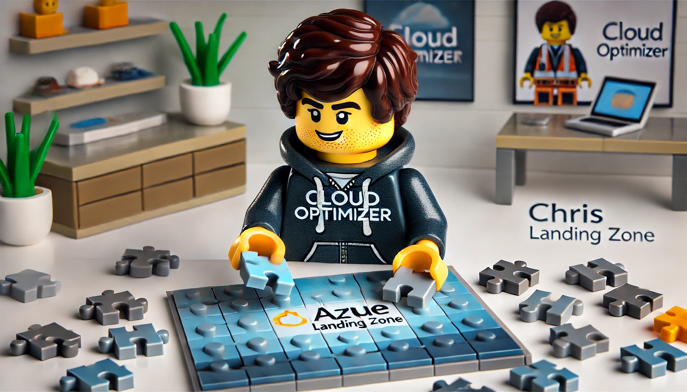

Starting a project in Azure requires careful planning and implementation of foundational best practices. To ensure a secure, compliant, and scalable cloud environment, there are key steps I always follow.

In this blog series, I'll dive into these essential topics, showing you how to automate each step using Infrastructure as Code (IaC). My primary tool of choice is Terraform, but I may also utilize Azure CLI or PowerShell where necessary.

{: .img-fluid}

## Get Familiar with Azure Landing Zones

Azure Landing Zones (ALZ) provide a structured approach to setting up Azure environments efficiently and securely. Before getting started, it’s beneficial to explore the following Microsoft resources:

- **Understand the [Cloud Adoption Framework](https://learn.microsoft.com/de-de/azure/cloud-adoption-framework/?WT.mc_id=MVP_439787){:target="_blank"}**  
  This framework provides comprehensive guidance, best practices, and documentation for preparing cloud adoption, optimizing existing Azure environments, and strengthening security and management.

- **Leverage the [Well-Architected Framework](https://learn.microsoft.com/azure/well-architected/?WT.mc_id=MVP_439787){:target="_blank"}**  
  This framework offers technical best practices to optimize and secure your Azure workloads while improving cost efficiency, operational excellence, reliability, and performance.

- **Strategic Planning — [Microsoft Assessments](https://learn.microsoft.com/assessments/?WT.mc_id=MVP_439787){:target="_blank"}**  
  Evaluate your business motivations for cloud adoption, identify cost implications, and determine key benefits like flexibility and security enhancements.

- **Comprehensive Assessment and Planning — [Azure Migrate](https://learn.microsoft.com/azure/migrate/?WT.mc_id=MVP_439787){:target="_blank"}**  
  Analyze your existing infrastructure to assess workload compatibility, compliance requirements, governance policies, and security needs before migration.

- **Manage and Optimize Post-Migration — [Azure Advisor](https://learn.microsoft.com/en-us/azure/advisor/?WT.mc_id=MVP_439787){:target="_blank"}**  
  Use Azure Advisor to continually monitor performance, security, cost management, and operational efficiency after migration.

## Key Preparation Steps for Your Azure Landing Zone

Setting up your Azure Landing Zone effectively involves several critical considerations:

1. **Naming Conventions** – Establish consistent, structured naming to enhance manageability.
2. **Policies** – Define governance policies for security, compliance, and operational standards.
3. **RBAC (Role-Based Access Control)** – Implement least privilege access controls for security.
4. **Hierarchy with Management Groups and Subscriptions** – Organize workloads efficiently.
5. **Monitoring** – Ensure proactive visibility into performance, security, and health.
6. **Backup Strategies** – Establish robust backup and disaster recovery policies.
7. **Patch Management** – Keep systems updated to minimize security vulnerabilities.
8. **Cost Management** – Track and optimize spending to prevent budget overruns.
9. **Connectivity** – Design secure and scalable network connectivity.
10. **Identity and Access Management** – Secure authentication and authorization practices.
11. **Workloads** – Optimize deployment strategies for critical applications.

In this blog series we will go deeply in each of these topics. The first post is already prepared and will be released soon. Stay tuned.

## Conclusion

Before launching into Azure, it's crucial to plan your environment thoroughly. This involves both technical and organizational preparation to establish effective guardrails. By defining clear policies, automating deployment with IaC, and continuously optimizing your setup, you can build a secure, compliant, and scalable cloud environment from the start.

Stay tuned for upcoming posts in this series where I'll break down each of these steps in detail!
