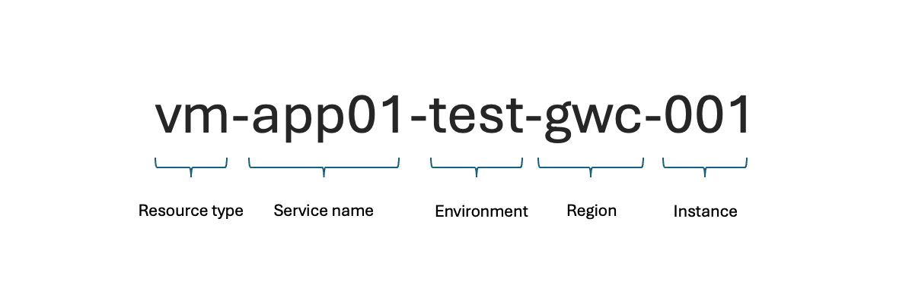

A **naming policy** is essential when moving to the cloud. A well-defined naming convention helps maintain order within your subscriptions and enables quick identification of connected resources.

In this blog post, I’ll cover the essentials of naming conventions: the rules, best practices, and common mistakes. Then, I’ll show you my preferred method of enforcing naming policies using **Infrastructure as Code (IaC)** and the **Azure Cloud Adoption Framework (CAF) module**.

## My Brief History of Naming Conventions

Over the past 12 years, I've seen many Azure environments evolve. Most customers started with an ungoverned approach before implementing company-wide rules and guardrails. This shift significantly improved their scalability and prevented operational chaos.

You might be familiar with naming conventions like planets, Star Wars characters, or Lord of the Rings references. While fun, these approaches become impractical as environments grow, especially with multi-region deployments. A structured naming convention is crucial to meet expanding demands.

## Why Naming Conventions Matter

Microsoft provides best practices for structuring resource names in Azure. A good naming convention enhances manageability, security, and automation, helping you quickly identify resources and understand their relationships.

### Key Naming Components



Source: [Microsoft Learn - Define your naming convention](https://learn.microsoft.com/azure/cloud-adoption-framework/ready/azure-best-practices/resource-naming?WT.mc_id=MVP_439787)

When defining names, consider:

- **Resource Type** (VM, Storage, VNet, etc.)
- **Environment** (Prod, Dev, Test, Staging)
- **Service Name** (e.g., Marketing-DB, ERP-Addon)
- **Region** (e.g., EU, US, APAC)

### Unique Naming Constraints

Not all Azure resources follow the same naming rules. Some allow hyphens, while others only permit lowercase letters and numbers. Additionally, certain names must be unique at different scopes:

- **Global**: DNS-dependent resources must be globally unique.
- **Resource Groups**: Resources of the same type within a group must have unique names.
- **Child Resources**: Subnets within a VNet must have unique names.

A **lowest common denominator** approach helps ensure naming consistency across different resource types.

## Best Practices for Azure Naming Conventions

Using **hyphens (-) for separation** improves readability. Define and standardize key components for resource names to enhance governance and automation.

## Automating Naming Conventions

Let's dive into the fun part! How do we use IaC to automatically implement and enforce our naming convention?

### Why Automation Matters

Consistency is key. Establishing a naming convention manually is error-prone, but automation ensures compliance.

**Terraform** simplifies enforcing naming standards using variables and Microsoft's **Cloud Adoption Framework (CAF) Naming Module**.

### Using Azure CAF Naming Module

By leveraging the **CAF Naming Module**, you can define your naming scheme once and reuse it for all future resources. Some parts are built-in, like the abbreviations for resource types, while others can be customized in the "data" block.

Additionally, I recommend using the **Azure Location Module**, which standardizes location abbreviations across all resources. This module is based on Microsoft's [Geo-code mapping](https://learn.microsoft.com/azure/backup/scripts/geo-code-list?WT.mc_id=MVP_439787) which is very useful to find the common and standardized abbreviations for Azure regions. I sometimes used different ones in the past.

### Terraform Implementation

Below is a Terraform configuration for creating a **resource group** with a standardized naming convention. You can easily adapt this for other resources.

```terraform
# Azure-Playground/terraform/ResourceGroup/main.tf
terraform {
  required_providers {
    azurerm = {
      source  = "hashicorp/azurerm"
      version = "~> 2.0"
    }
    azurecaf = {
      source  = "aztfmod/azurecaf"
      version = "~> 1.2"
    }
  }
}

provider "azurerm" {
  features {}
}

module "azure_location" {
  source  = "azurerm/locations/azure"
  version = "0.2.4"
  location = "westeurope"
}

locals {
    location = module.azure_location.location
    region_short = [module.azure_location.short_name]
    name = "Naming"
    caf_prefixes = ["MyApp"]
    caf_suffixes = ["Test", "001"]
    common_tags  = {
        environment = "Test"
        team        = "Cloud Infrastructure"
        location    = module.azure_location.display_name
    }
}

data "azurecaf_name" "rg" {
    name          = local.name
    resource_type = "azurerm_resource_group"
    suffixes      = concat(local.region_short, local.caf_suffixes)
    clean_input   = true
}

resource "azurerm_resource_group" "rg" {
    name     = data.azurecaf_name.rg.result
    location = module.azure_location.name
    tags     = local.common_tags
}
```

This Terraform module ensures compliance with Microsoft's best practices while simplifying naming enforcement. Check out my [**GitHub repo**](https://github.com/chris4jahn/Azure-Playground) for more details.

## Conclusion

A structured **naming convention** is crucial for maintaining order in your growing **Azure** environment. **Automating naming policies** with **Terraform** or another **Infrastructure as Code (IaC)** tool ensures consistency and prevents chaos. Investing time in a well-defined strategy today saves you from significant headaches as your cloud footprint expands.
